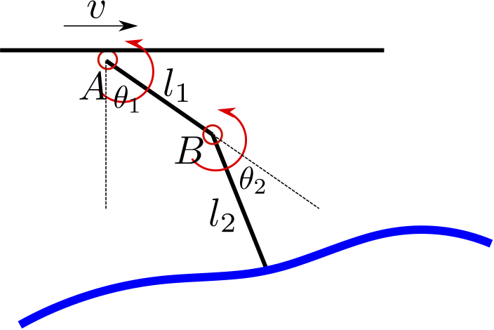

# Finger Adaptive Exploration

* This is the source code of the simulation platform of my bachelor thesis.
* This platform can simulate the surface exploration process of mechanical finger with/without controllers.

* The finger was modeled as a two-link system, the base of which could translate freely and tip placed on the surface.
* During the moving process, the finger base would move with a constant horizontal speed along the surface.

## Run the platform
After compiling ...

### Simulation
``` bash
roslaunch adaption_finger display.launch
```
This launch file will start rviz and display the mechanical finger. The configuration of finger parameters could be find in adaption_launch/config

### Finger movement
#### Without controller
``` bash
roslaunch adaption_launch finger_simulation.launch
```
This will launch the force and motion calculator with my dynamic and kinematic models. Since the start position of finger tip is higher than the surface, it would fall immediately after simulation started.

#### Surface exploration with PID controller
For surface exploration, the tip of the finger should not leave the surface, but the contact force should be as smaller as possible.
``` bash
roslaunch adaption_lauch finger_pid.launch
```
This will run the PID controller for surface exploration. The error of contact force was redefined for this task.

#### Contact tooling with PID controller
``` bash
roslaunch adaption_lauch finger_pid_line.launch
```
In this case, the contact force would follow a slope rule.

#### Surface follow-up with compliant controller
``` bash
roslaunch adaption_launch finger_imp.launch
```
To automatically follow the surface contour, the finger was controlled with compliant controller. The shape of surface in this case could be more complex.

## Parameters
The parameter for those launchers could be find in adaption_launch/config. Modifying the geometry, weight and frequency parameters is not recommended.
* **Surface**: surface type. 1 -- plain surface; 2 -- slope surface. 3 & 4 are for compliant contoller only. 3 has a changing roughness, and 4 is a combination of plain and slope with a cliff.
* **Line**: Ax + By + C = 0 can describe the projection of the slope surface to the working plane. Make sure B>0.
* **InitialPose**: (x, y, z) -- the initial position of finger base. (theta1, theta2) -- the initial angular position of the A, B joint.
* Contoller-specified parameters: those parameters were adjusted and seleted by me. But you can also change it.
